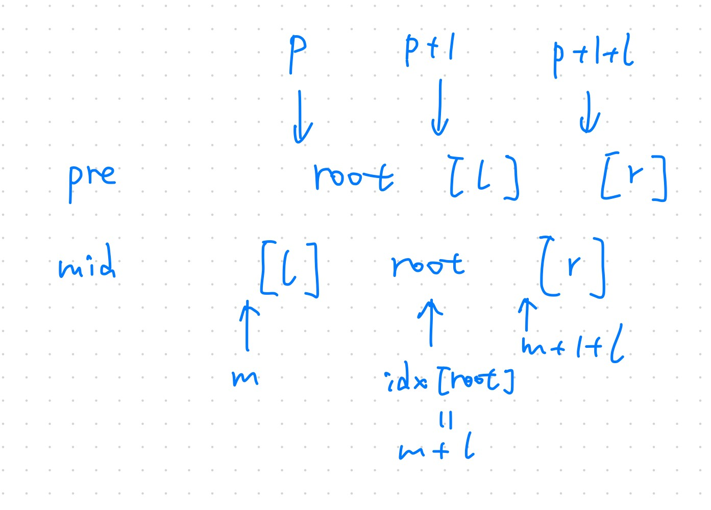

An inorder binary tree traversal can be implemented in a non-recursive way with a stack. For example, suppose that when a 6-node binary tree (with the keys numbered from 1 to 6) is traversed, the stack operations are: push(1); push(2); push(3); pop(); pop(); push(4); pop(); pop(); push(5); push(6); pop(); pop(). Then a unique binary tree (shown in Figure 1) can be generated from this sequence of operations. Your task is to give the postorder traversal sequence of this tree.


Figure 1

### Input Specification:

Each input file contains one test case. For each case, the first line contains a positive integer *N* (≤30) which is the total number of nodes in a tree (and hence the nodes are numbered from 1 to *N*). Then 2*N* lines follow, each describes a stack operation in the format: "Push X" where X is the index of the node being pushed onto the stack; or "Pop" meaning to pop one node from the stack.

### Output Specification:

For each test case, print the postorder traversal sequence of the corresponding tree in one line. A solution is guaranteed to exist. All the numbers must be separated by exactly one space, and there must be no extra space at the end of the line.

### Sample Input:

```in
6
Push 1
Push 2
Push 3
Pop
Pop
Push 4
Pop
Pop
Push 5
Push 6
Pop
Pop
```

### Sample Output:

```out
3 4 2 6 5 1
```


````c
#include <stdio.h>
#include <stdlib.h>
#include <string.h>
#define MAX_NODES 30

typedef struct {
    int data[MAX_NODES];
    int top;
} Stack;

void push(Stack* p_stack, int val);
int pop(Stack* p_stack);
void postOrderTraversal(int preL, int inL, int postL, int n);

int pre_order[MAX_NODES];
int in_order[MAX_NODES];
int post_order[MAX_NODES];

int main() {
    // read and store in 2 different type of order
    int n;
    scanf("%d\n", &n);
    int i, x, len;
    int cnt_pre = 0, cnt_in = 0;
    Stack stack; stack.top = -1;
    char tmp[10];
    for ( i=0; i<2*n; i++ ) {
        scanf("%[^\n]%*c", tmp);
        len = strlen(tmp);
        if ( len == 6 || len == 7 ) {   // == push x
            x = atoi(tmp+5);
            pre_order[cnt_pre] = x;
            push(&stack, x);
            cnt_pre ++;
        }
        else if ( len == 3 ) {  // == pop
            in_order[cnt_in] = pop(&stack);
            cnt_in ++;
        }
    }
    // get the post order by known pre and in
    postOrderTraversal(0, 0, 0, n);
    // print
    for ( i=0; i<n-1; i++ ) {
        printf("%d ", post_order[i]);
    } printf("%d", post_order[i]);

    return 0;
}

void push(Stack* p_stack, int val) {
    p_stack->top ++;
    p_stack->data[p_stack->top] = val;
}

int pop(Stack* p_stack) {
    return p_stack->data[p_stack->top--];
}

void postOrderTraversal(int preL, int inL, int postL, int n) {
     if (n) {                                                // 递归的终止条件是 n == 0
         post_order[postL + n - 1] = pre_order[preL];                    // 把 pre_order 的第一个元素根节点，存放到 post_order 的最后一个位置
 
         int pos = inL;
         while (pos < inL + n && in_order[pos] != pre_order[preL]) {     // 通过循环，找到根节点在 in_order 中对应的下标位置
             pos++;
         }
 
         int leftNum = pos - inL;                            // 左子树的节点个数
         int rightNum = n - 1 - leftNum;                     // 右子树的节点个数
 
         postOrderTraversal(preL + 1, inL, postL, leftNum);  // 通过递归得到左子树的后序序列并存放到 post_order 前 leftNum 个位置
         postOrderTraversal(preL + leftNum + 1, pos + 1, postL + leftNum, rightNum); // 通过递归得到右子树的后序序列并存放到 post_order 剩下的 rightNum 个位置
    }
}
````


