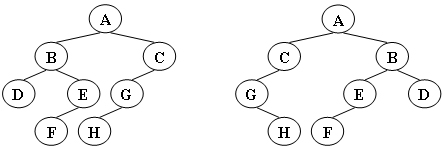

给定两棵树T1和T2。如果T1可以通过若干次左右孩子互换就变成T2，则我们称两棵树是“同构”的。例如图1给出的两棵树就是同构的，因为我们把其中一棵树的结点A、B、G的左右孩子互换后，就得到另外一棵树。而图2就不是同构的。

|  |
| :--------------: |
|       图1        |
|  |
|       图2        |

现给定两棵树，请你判断它们是否是同构的。

### 输入格式:

输入给出2棵二叉树树的信息。对于每棵树，首先在一行中给出一个非负整数*N* (≤10)，即该树的结点数（此时假设结点从0到*N*−1编号）；随后*N*行，第*i*行对应编号第*i*个结点，给出该结点中存储的1个英文大写字母、其左孩子结点的编号、右孩子结点的编号。如果孩子结点为空，则在相应位置上给出“-”。给出的数据间用一个空格分隔。注意：题目保证每个结点中存储的字母是不同的。

### 输出格式:

如果两棵树是同构的，输出“Yes”，否则输出“No”。

### 输入样例1（对应图1）：

```in
8
A 1 2
B 3 4
C 5 -
D - -
E 6 -
G 7 -
F - -
H - -
8
G - 4
B 7 6
F - -
A 5 1
H - -
C 0 -
D - -
E 2 -
```

### 输出样例1:

```out
Yes
```

### 输入样例2（对应图2）：

```
8
B 5 7
F - -
A 0 3
C 6 -
H - -
D - -
G 4 -
E 1 -
8
D 6 -
B 5 -
E - -
H - -
C 0 2
G - 3
F - -
A 1 4
```

### 输出样例2:

```
No
```


````c
#include <stdio.h>
#include <stdlib.h>
#define Null -1
#define MAXSIZE 10

typedef struct {
    char data;
    int left;
    int right;
} TreeNode;
typedef TreeNode* BinTree;

TreeNode bt1[MAXSIZE];
TreeNode bt2[MAXSIZE];  // global variable

int ReadTree(BinTree bt);
int IsIsomorphism(int bt1_root, int bt2_root);

int main() {
    int bt1_root = ReadTree(bt1);
    int bt2_root = ReadTree(bt2);
    IsIsomorphism(bt1_root, bt2_root)==1 ? printf("Yes") : printf("No");
    return 0;
}

int ReadTree(BinTree bt) {
    int n, i;
    int root = Null;
    scanf("%d", &n);
    int* check = (int*)malloc(n*sizeof(int));   // to check which is the root
    for (i=0; i<n; i++) {
        check[i] = 0;
    }
    if (n) {    // make sure n != 0
        for (i=0; i<n; i++) {   // loop n times to scan the data
            char c_left, c_right;
            scanf("\n%c %c %c", &bt[i].data, &c_left, &c_right);    // **\n**
            // check c_left
            if (c_left != '-') {
                bt[i].left = c_left-'0';
                check[c_left-'0'] = 1;
            }
            else {
                bt[i].left = Null;
            }
            //check c_right
            if (c_right != '-') {
                bt[i].right = c_right-'0';
                check[c_right-'0'] = 1;
            }
            else {
                bt[i].right = Null;
            }
        }
        for (i=0; i<n; i++) {
            if (check[i] == 0) {
                root = i;
                break;
            }
        }
    }
    free(check);
    return root;
}

int IsIsomorphism(int bt1_root, int bt2_root) {
    // about parent(root)
    if (bt1_root == Null && bt2_root == Null) { // both are empty
        return 1;
    }
    if ((bt1_root==Null && bt2_root!=Null) || (bt1_root!=Null && bt2_root==Null)) {
        // one is empty and the other is not empty
        return 0;
    }
    if (bt1[bt1_root].data != bt2[bt2_root].data) {
        // if the root data is different
        return 0;
    }
    // about child
    if (bt1[bt1_root].left==Null && bt2[bt2_root].left==Null) {
        return IsIsomorphism(bt1[bt1_root].right, bt2[bt2_root].right);
        // both have no left child
    }
    // if ((bt1[bt1_root].left!=Null&&bt1[bt1_root].right==Null) && 
    // (bt2[bt2_root].left==Null&&bt2[bt2_root].right!=Null)) {
    //     return IsIsomorphism(bt1[bt1_root].left, bt2[bt2_root].right);
    // }
    // if ((bt1[bt1_root].left==Null&&bt1[bt1_root].right!=Null) &&
    //(bt2[bt2_root].left!=Null&&bt2[bt2_root].right==Null)) {
    //     return IsIsomorphism(bt1[bt1_root].right, bt2[bt2_root].left);
    // }
    if ((bt1[bt1_root].left!=Null && bt2[bt2_root].left!=Null) && 
        (bt1[bt1[bt1_root].left].data == bt2[bt2[bt2_root].left].data)) {
        // 两个树的左子树同时不空，且值相同
        return(IsIsomorphism(bt1[bt1_root].left, bt2[bt2_root].left) && 
               IsIsomorphism(bt1[bt1_root].right, bt2[bt2_root].right));
    }
    else {  // else 包含了很多，有上面注释掉的两条if，也可能是两个树的左子树同时不空，但值不同
        return(IsIsomorphism(bt1[bt1_root].left, bt2[bt2_root].right) && 
               IsIsomorphism(bt1[bt1_root].right, bt2[bt2_root].left));
    }
}
````

