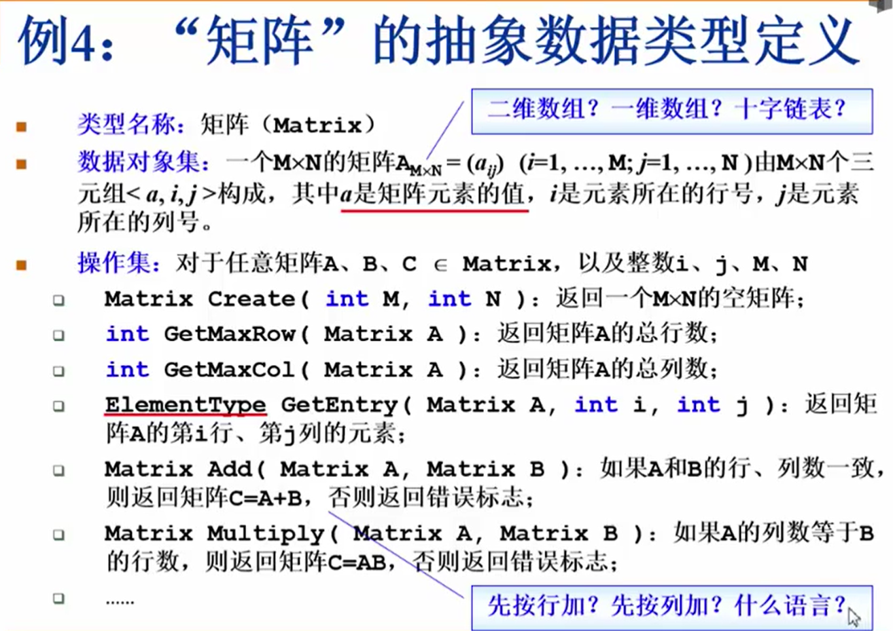
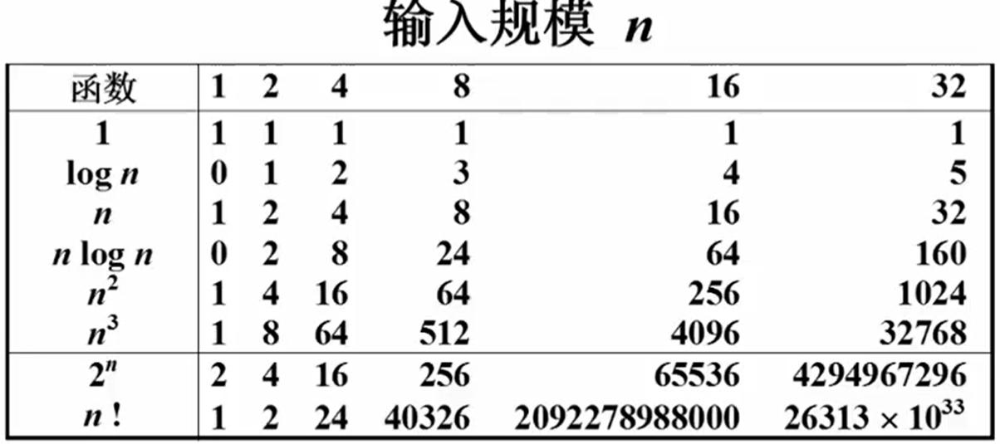
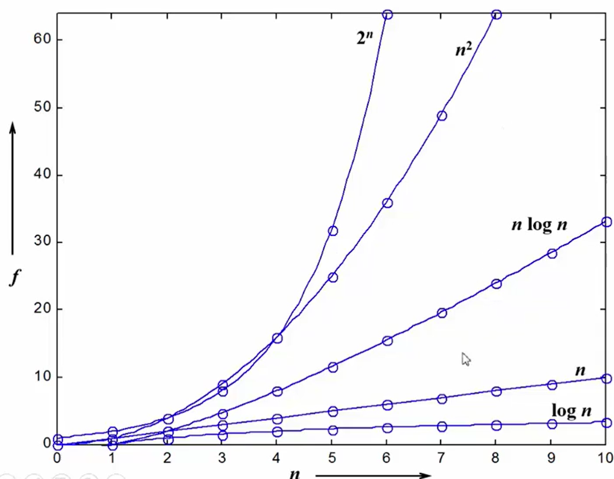
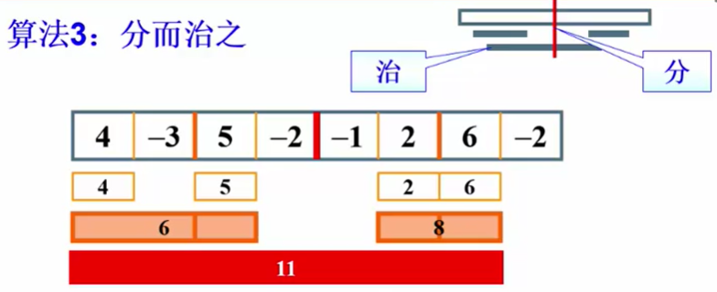

# 01基本概念

## 什么是数据结构

### 例一: 图书馆放书的一千种方式

**解决问题的效率, 和数据组织方式有关**

### 例二: `PrintN`函数的实现

实现一个函数`PrintN()`, 使得传入正整数参数`N`之后, 打印 1~N (包括两端) 之间的所有正整数

```` c
// 循环实现
void PrintN(int n) {
    int i;
    for (i=0; i<=n; i++) {
        printf("%d ", i);
    }
}
// 递归实现
void PrintN2(int n) {
    if (n >= 0) {
        PrintN2(n-1);
        printf("%d ", n);
    }
}
````

结果就是 `n=10, 1000, 10000, 100000...`在`100000`时, 用递归的程序爆掉了

空间被占用完了... ...

**解决问题的效率, 和空间利用效率有关**

### 例三: 计算给定多项式在给定点`x`处的值

$$
f(x) = a_0 + a_1x +\dots+a_{n-1}x^{n-1} + a_nx^n
$$

````c
// 傻瓜算法
double f(int n, double a[], double x) {
    int i;
    double res = 0;
    for (i=0; i<=n; i++) {
        res += a[i] * pow(x, i);
    }
    return res;
}
````

秦九韶算法:
$$
f(x) = a_0 + x(a_1+x(\dots x(a_{n-1}+x(a_n))\dots ))
$$

````c
// 秦九韶算法
double f(int n, double a[], double x) {
    int i;
    double res = a[n];
    for (i=n-1; i>=0; i--) {
        res = a[i] + x*res;
    }
    return res;
}
````

孰好孰坏? 测试效率即可 -> 用同一个多项式, 测试运行时间

实测时间的方法:  `clock()函数 & CLK_TCK`

````c
clock_t clock(void)
该函数返回自程序启动起，处理器时钟所使用的时间。如果失败，则返回 -1 值。
这个时间单位是 CLK_TCK 即 "时钟打点"
常数 CLK_TCK: 机器时钟每秒所走过的时针打点数
````

使用模板:

````c
#include <stdio.h>
#include <time.h>

int main() {
    clock_t start, stop; // c_clock 是 clock() 返回类型
    double duration;	 // 记录运行时间, 单位为 s
    start = clock();	 // start
    MyFunction();		 // 运行被测函数
    stop = clock();		 // stop
    duration = ((double)(stop-start)) / CLK_TCK;
    // 其他不在测试范围的处理...
    
    return 0;
}
````

实验: 计算如下多项式:
$$
f(x) = \sum^9_{i=0}i\cdot x^i \\在 x=1.1 处的值
$$

````c
#include <stdio.h>
#include <math.h>
#include <time.h>
#define MAX_N 10  // 系数有 10 项
#define MAX_K 1e7 // 一次调用时间太短, 重复运行这么多次

// 傻瓜算法
double f1(int n, double a[], double x) {
    int i;
    double res = 0;
    for (i=0; i<=n; i++) {
        res += a[i] * pow(x, i);
    }
    return res;
}
// 秦九韶算法
double f2(int n, double a[], double x) {
    int i;
    double res = a[n];
    for (i=n-1; i>=0; i--) {
        res = a[i] + x*res;
    }
    return res;
}

int main() {
    clock_t start, stop;
    double duration;
    int i;
    // get coefficients
    double a[MAX_N];
    for (i=0; i<10; i++) {
        a[i] = i;
    }
    //
    double x = 1.1;
    start = clock();
    for (i=0; i<MAX_K; i++) {
        f1(MAX_N, a, x);
    }
    stop = clock();
    duration = ((double)(stop-start)) / CLK_TCK / MAX_N;
    printf("duration of f1 is %e\n", duration);
    // 
    start = clock();
    for (i=0; i<MAX_K; i++) {
        f2(MAX_N, a, x);
    }
    stop = clock();
    duration = ((double)(stop-start)) / CLK_TCK / MAX_N;
    printf("duration of f2 is %e\n", duration);

    return 0;
}

````

运行结果: 

````c
duration of f1 is 2.179000e-001
duration of f2 is 2.300000e-002 // 差一个数量级!
````

**解决问题的效率, 和算法巧妙程度有关**

### 到底什么是数据结构? ? ?

- 数据对象在计算机中的组织方式
  - 逻辑结构
    - 线性结构, 树, 图 ... ...
  - 物理存储结构
- 数据对象必定与一系列加在其上的操作相关联
- 完成这些操作的方法就是算法

#### 抽象数据类型 (Abstrat Data Type)

- 数据类型	
  - 数据对象集
  - 数据集合相关联的操作集

C 中, 两者分开, 而在 java, cpp 等语言中, 两者合起来并称为 "类"

- 抽象
  - 和存放数据的机器无关
  - 和数据存储的物理结构无关
  - 和实现操作的算法和编程语言无关

**只描述数据对象集和相关操作集 <是什么> , 不涉及 <如何做到>**



## 什么是算法 (Algorithm)

### 定义

- 一个有限指令集
- 有输出
- 会终止
- 描述每一条指令时
  - 不能有歧义
  - 计算机可以处理
  - 描述不依赖于任何一种计算机语言以及具体实现手段

### 什么事好的算法

- 空间复杂度S(n): 算法写成的程序在执行时占用的存储单元的长度
- 时间复杂度T(n): 根据算法写成的程序在执行时耗费的时间的长度

#### 空间复杂度

`PrintN`函数的递归写法:
$$
S(N) = C\cdot N
$$
`PrintN`函数的循环写法:
$$
S(N) = C
$$

#### 时间复杂度 (数乘除法的数量)

计算多项式的傻瓜算法:
$$
\sum^n_{i=1}i=\frac{(n^2+n)} 2\\ \therefore T(n) = C_1n^2 + C_2n
$$
计算多项式的秦九韶算法
$$
T(n) = Cn
$$

**在分析一般算法效率时， 我们通常关注最坏情况复杂度$T_{worst}(n)$**

#### 复杂度渐进表示法





#### 复杂度分析小窍门

- 两段算法复杂度有$T_1(n)=O(f_1(n))$, $T_2(n)=O(f_2(n))$, 则：
  - 两段代码拼接 $T_1(n)+T_2(n)=max(O(f_1(n))+O(f_2(n)))$
  - 两段代码嵌套  $T_1(n)\times T_2(n)=O(f_1(n))\times O(f_2(n))$
- 若 $T(n)$ 是关于 $n$ 的  $k$ 阶多项式, 则 $T(n) = O(n^k)$
- 一个循环的复杂度等于循环次数乘以循环体复杂度
- `if-else`结构复杂度取决于`if`的条件判断复杂度和各个分支的复杂度, 几个中取最大

## 应用实例_最大子列和

给定$N$个整数 (有可能有负数) 的序列 $\{A_1,A_2,\cdots,A_N\}$求函数 $f(i,j) = max\{0, \sum_{k=i}^jA_k\}$最大值

````c
// 算法一_最傻瓜算法
int MaxSubSequenceSum1(int a[], int len) {
    int this_sum, max_sum = 0;
    int i, j, k;
    for (i=0; i<len; i++) {
        for (j=i; j<len; j++) {
            // calculate this_sum
            this_sum = 0;
            for (k=i, k<=j; k++) {
                this_sum += a[k];
            }
            // replace max_sum if need to
            if (this_sum > max_sum) {
                max_sum = this_sum;
            }
        }
    }

    return max_sum;
}
````

算法一复杂度居然达到了$O(n^3)$ ! !

````c
// 算法二_每次加一位即可
int MaxSubSequenceSum1(int a[], int len) {
    int this_sum, max_sum = 0;
    int i, j;
    for (i=0; i<len; i++) {
        this_sum = 0;
        for (j=i; j<len; j++) {
            // calculate this_sum
            this_sum += a[j];
            // replace max_sum if need to
            if (this_sum > max_sum) {
                max_sum = this_sum;
            }
        }
    }

    return max_sum;
}
````

算法二复杂度减小到了$O(n^2)$ ! !

### 分治法 (Divide and conquer)




复杂度计算: 
$$
\begin{align}
T(N) &= 2T(N/2)+cN\\&=2(2T(N/4)+cN/2)+cN\\
&= \cdots \cdots\\ &=2^kO(1)+ckN;
其中 N/2^k = 1\\&= N+cN\log N \\
\therefore T(N) &= O(N\log N)
\end{align}
$$
````c
// 算法三_分治_Divide and Conquer
int Max3( int A, int B, int C ) {       // return the max_num of 3 nums
    return A > B ? (A > C ? A : C) : (B > C ? B : C);
}

int DivideAndConquer(int List[], int left, int right) {   // use Divide and Conquer
    int max_sum_left, max_sum_right ;    // store the max_sum of left nums and the max_num of right nums
    int sum_left, sum_right;             // store the sum of left and right nums
    int max_border_sum_left, max_border_sum_right, max_border_sum;  
    // store the max_sum out_of_border   // it must be divided into the left part and the right part
    int border_sum;                      // store the sum out_of_border
    int i, center;
    
    if (left == right) {                // divide until it has only one element between left and right
        if (List[left] > 0) {
            return List[left];
        }
        else {
            return 0;
        }
    }
    center = (right+left) / 2;
    max_sum_left = DivideAndConquer(List, left, center);
    max_sum_right = DivideAndConquer(List, center+1, right);

    // calculate the sum out_of_border
    max_border_sum_left = 0;
    border_sum = 0;
    for (i=center; i>=left; i--) {      // scan from center to left
        border_sum += List[i];
        if (border_sum > max_border_sum_left) {
            max_border_sum_left = border_sum;
        }
    }
    border_sum = 0;     // must be reset to 0
    max_border_sum_right = 0;
    for (i=center+1; i<=right; i++) {   // scan from center to right
        border_sum += List[i];
        if (border_sum > max_border_sum_right) {
            max_border_sum_right = border_sum;
        }
    }
    max_border_sum = max_border_sum_left + max_border_sum_right;

    return Max3(max_sum_right, max_sum_left, max_border_sum);
}

int MaxSubseqSum3(int List[], int N) {
    return DivideAndConquer(List, 0, N-1);
}
````

### 在线处理

````c
// 算法四_在线处理
int MaxSubseqSum4(int List[], int len) {
    int max_sum=0, sum=0;
    int i;

    for (i=0; i<len; i++) {
        sum += List[i];     // accumulate to the right
        if (sum > max_sum) {
            max_sum = sum;  // update the max_sum
        }
        if (sum < 0) {      // if the sum < 0 at this time, 
            sum = 0;        // then it will have no benefit to increase the sum then 
        }                   // therefore, turn the sum to zero
    }
    return max_sum;
}
````

