# 02线性结构

## 线性表及其实现

### 引子: 多项式表示

如何用程序设计语言表示
$$
f(x) = a_0+a_1x+\cdots+a_{n-1}x^{n-1}+a_nx^n
$$

#### 表示方法一: 顺序存储直接表示

用数组表示, `a[i]`表示对应次数的各项的系数

- 两个多项式相加: 两个数组对应分量相加

**缺陷**: 如何表示$f(x)=x+3x^{2000}$? 	

> 浪费空间, 我能不能只保存非零项? 

#### 表示方法二: 我只表示非零项_用数组

每个非零项$a_ix^i$涉及两个信息: 系数和指数

所以可以将多项式的非零的一项看成一个二元组

故可以用结构数组来表示

````c
typedef struct {
    double coefficient;
    int degree;
} Term;
````

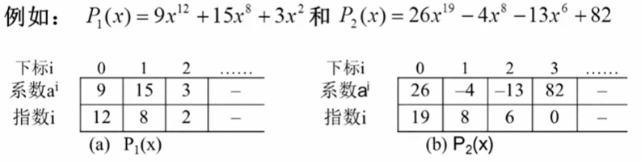

**相加运算: 按指数大小有序存储!**

相加运算: 若都是按照指数从大到小排列: 两个从头开始比较, 

- 指数不一样大: 大的直接输出为结果的一项, 后往右移一位与小的这一项比较...
- 指数一样大: 相加系数输出, 后都往右移继续比较

````c
#include <stdio.h>
#define P1_NUM_OF_TERMS 3
#define P2_NUM_OF_TERMS 4

typedef struct {
    double coefficient;
    int degree;
} Term;

int main() {
	Term p1[P1_NUM_OF_TERMS] = {{9,12}, {15,8}, {3,2}};
	Term p2[P2_NUM_OF_TERMS] = {{26,19}, {-4,8}, {-13,6}, {82, 0}};
	Term res[P1_NUM_OF_TERMS+P2_NUM_OF_TERMS];	//store the result, 
    		// num_of_terms is up to P1_NUM_OF_TERMS+P2_NUM_OF_TERMS
	// plus
	Term* p_p1 = &p1; Term* p_p2 = &p2;
	Term* p_p1_init = p_p1; Term* p_p2_init = p_p2;
	int cnt = 0;	// num_of_terms of result
	int i;
	while (1) {
		if (p_p1-p_p1_init == P1_NUM_OF_TERMS || p_p2-p_p2_init == P2_NUM_OF_TERMS) {
			if (p_p1-p_p1_init >= P1_NUM_OF_TERMS) {
				int n_remain = P2_NUM_OF_TERMS - (p_p2-p_p2_init);
				for (i=0; i<n_remain; i++) {
					res[cnt] = *p_p2;
					p_p2 ++;
					cnt ++;
				}
			}
			else {
				int n_remain = P1_NUM_OF_TERMS - (p_p1-p_p1_init);
				for (i=0; i<n_remain; i++) {
					res[cnt] = *p_p1;
					p_p1 ++;
					cnt ++;
				}
			}
			break;
		}
		if (p_p1->degree > p_p2->degree) {
			res[cnt] = *p_p1;
			p_p1 ++;
		}
		else if (p_p1->degree < p_p2->degree) {
			res[cnt] = *p_p2;
			p_p2 ++;			
		}
		else {
			res[cnt].coefficient = p_p1->coefficient + p_p2->coefficient;
			res[cnt].degree = p_p1->degree;
			p_p1 ++; p_p2 ++; 
		}
		cnt ++;
	}
	// print
	for (i=0; i<cnt; i++) {
		printf("+(%.1fx^%d)", res[i].coefficient, res[i].degree);
	}
    return 0;
}
````

运行结果:

````c
+(26.0x^19)+(9.0x^12)+(11.0x^8)+(-13.0x^6)+(3.0x^2)+(82.0x^0)
````

#### 表示方法二: 我只表示非零项_用链表

````c
#include <stdio.h>
#include <stdlib.h>

typedef struct _Node {
    int cof;
    int exp;
	struct _Node *next;
} PolyNode;

typedef struct {
	PolyNode* head;
	PolyNode* tail;
} Poly;

void create(Poly* poly);
void plus(Poly* poly1, Poly* poly2, Poly* poly_res);
void insert(Poly* poly_res, int cof, int exp);
void FreePoly(Poly* poly);

int main() {
	Poly poly1, poly2;
	poly1.head = '\0'; poly2.head = '\0';	// initialize
	// input
	create(&poly1);
	create(&poly2);
	// plus
	Poly poly_res;
	poly_res.head = '\0';
	plus(&poly1, &poly2, &poly_res);
	// print
	PolyNode* i;
	for (i=poly_res.head; i; i=i->next) {
		printf("+(%dx^%d)", i->cof, i->exp);
	}
	// free
	FreePoly(&poly1); 
	FreePoly(&poly2);
	FreePoly(&poly_res);
	
    return 0;
}

void create(Poly* poly) {
	int cof, exp;
	int n;	// num_of_terms
	scanf("%d", &n);
	int i;
	for (i=0; i<n; i++) {
		scanf("%d %d", &cof, &exp);
		PolyNode* p_pn = (PolyNode*)malloc(sizeof(PolyNode));
		p_pn->next = '\0';
		p_pn->cof = cof;
		p_pn->exp = exp;
		if (poly->head == '\0') {
			poly->head = p_pn;
			poly->tail = p_pn;
		}
		else {
			poly->tail->next = p_pn;
			poly->tail = p_pn;
		}
	}
}

void insert(Poly* poly_res, int cof, int exp) {
	PolyNode* p_pn = (PolyNode*)malloc(sizeof(PolyNode));
	p_pn->next = '\0';
	p_pn->cof = cof;
	p_pn->exp = exp;
	if (poly_res->head == '\0') {
		poly_res->head = p_pn;
		poly_res->tail = p_pn;
	}
	else {
		poly_res->tail->next = p_pn;
		poly_res->tail = p_pn;	
	}
}

void plus(Poly* poly1, Poly* poly2, Poly* poly_res) {
	int cnt = 0;
	PolyNode* p_p1 = poly1->head; PolyNode* p_p2 = poly2->head;
	while (1) {
		if (p_p1 == '\0' || p_p2 == '\0') {
			if (p_p1 == '\0') {
				while (p_p2 != '\0') {
					insert(poly_res, p_p2->cof, p_p2->exp);
					cnt ++;
					p_p2 = p_p2->next;	
				}
			}
			else {
				while (p_p1 != '\0') {
					insert(poly_res, p_p1->cof, p_p1->exp);
					cnt ++;
					p_p1 = p_p1->next;	
				}
			}
			break;
		}
		if (p_p1->exp > p_p2->exp) {
			insert(poly_res, p_p1->cof, p_p1->exp);
			cnt ++;
			p_p1 = p_p1->next;
		}
		else if (p_p1->exp < p_p2->exp) {
			insert(poly_res, p_p2->cof, p_p2->exp);
			cnt ++;
			p_p2 = p_p2->next;			
		}
		else {
			insert(poly_res, p_p1->cof + p_p2->cof, p_p1->exp);
			cnt ++;
			p_p2 = p_p2->next; p_p1 = p_p1->next;
		}
	}
}

void FreePoly(Poly* poly) {
	PolyNode* i;
	for (i=poly->head; i; i=i->next) {
		free(i);
	}
}
````

### 线性表与顺序存储

概念: 表头, 表尾, 长度 (元素个数), 空表

#### 线性表的抽象数据类型描述

- 类型名称: 线性表 (List)
- 数据对象集: 线性表是 n 个元素构成的有序序列
- 操作集: 线性表 L, 表中`int i`表示位置, 元素 X 
  - `List MakeEmpty()`初始化一个空表
  - `ElementType FindKth(int K, List L)`根据位序 K, 返回相应元素
  - `int Find(ElementType X, List L)`在表中查找 X 第一次出现的位置
  - `void Insert(ElementType X, int i, List L)`在位序 i 前插入一个新元素 X
  - `void Delete(int i, List L)`删除指定位序 i 的元素
  - `int Length(List L)`返回线性表 L 的长度 n

#### 线性表顺序存储实现

##### 利用数组

````c
struct LNode {
    ElementType Date[MAXSIZE];
    int Last;	// 表示列表末尾的位置
};
typedef struct LNode* List;	// 将 struct LNode*命名为 List
struct LNode L;	// 定义线性表变量
List PtrL;		// 定义指向一个线性表的指针
// 访问下标为 i 的元素: L.Data[i] 或者 PtrL->Data[i]
// 线性表长度: L.Last+1 或者 PtrL->Last+1
````

**注意**

**#define** 是 C 指令，用于为各种数据类型定义别名，与 **typedef** 类似，但是它们有以下几点不同：

- **typedef** 仅限于为类型定义符号名称，**#define** 不仅可以为类型定义别名，也能为数值定义别名，比如您可以定义 1 为 ONE。
- **typedef** 是由编译器执行解释的，**#define** 语句是由预编译器进行处理的。

例如：

```
typedef char * STRING;
```

编译器把 STRING 解释为一个类型的表示符，该类型指向 char。因此：

```
STRING name, sign;
```

相当于：

```
char * name , * sign;  
```

但是，如果这样假设：

```
#define STRING char *
```

然后，下面的声明：

```
STRING name, sign;
```

将被翻译成：

```
char * name, sign;
```

这导致 name 才是指针。

###### 主要操作的实现

````c
// 初始化
List MakeEmpty(){
    List PtrL;
    Ptrl = (List)malloc(sizeof(struct LNode));
    PtrL->Last = -1;
    return PtrL;
}
````

````c
// 查找
int Find(ElementType X, List PtrL) {
    int i = 0;
    while (i<=PtrL->Last && PtrL->Data[i]!=X) {
        i++				// traversal
    }	
    if (i>PtrL->Last) {
        return -1;		// 没找到
    }
    else {
        return i;		// 返回位置
    }
}
````

````c
// 插入到第 i 个位置_下标为 i-1
void Insert(ElementType X, int i, List PtrL) {
    int j;
    if (PtrL->Last == MAXSIZE-1) {
        printf("表满");
        return;
    }
    if (i<1 || i>PtrL->Last+2) {
        printf("位置不合法");
        return;
    }
    for(j=PtrL->Last; j>=i-1; j--) {
        PtrL->Data[j+1] = PtrL->Data[j];//将a_{i-1}-a_n倒序向后移动
    }
    PtrL->Data[i-1] = X;
    PtrL->Last ++;
    return;
}
````

````c
// 删除第 i 个元素
void Delete(int i, List PtrL) {
    int j;
    if (i<1 || i>PtrL->Last+1) {
        printf("位置不合法");
        return;
    }
    for (j=i; j<=PtrL->Last; j++) {
        PtrL->Data[j-1] = PtrL->Data[j];//将a_{i+1}-a_n顺序向前移动
    }
    PtrL->Last --;
    return;
}
````

##### 利用链表

- 不要求逻辑上相邻的两个元素物理上也相邻

- 插入, 删除不需要移动数据, 只需要修改链

````c
struct LNode {
    ElemenType Data;
    struct LNode* Next;
};
typedef struct LNode* List;
struct LNode L;
List PtrL;
````

###### 主要操作的实现

````c
// 求表长_遍历
int Length(List PtrL) {
    List p = PtrL;
    int cnt = 0;
    for (;p;p=p->Next) {
        cnt++;
    }
    return cnt;
}
````

````c
// 查找
// 按序号查找: FindKth
List FindKth(int K, List PtrL) {
    List p = PtrL;
    int i = 1;
    while (p!='\0' && i<K) {
        p = p->Next;
        i ++;
    }
    if (i==K) {
        return p;
    }
    else {
        return '\0';// 不能直接 return p, 
        // 若直接 return p, 当k<=0时，循环结束，会返回头指针，出现错误
    }
}
// 按值查找: Find
List Find(ElemrntType X, List PtrL) {
    List p = PtrL;
    while (p!='\0' && p->Data!=X) {
        p = p->Next;
    }
    return p;	// 找没找到都是 return p;
}
````

````c
// 插入在第 i-1 个结点后面
List Insert(ElementType X, int i, List PtrL) {
    List p, s;
    if (i==1) {		//插在表头特殊处理
        s = (List)malloc(sizeof(struct LNode));
        s->Data = X;
        s->Next = PtrL;
        return s;
    }
    p = FindKth(i-1, PtrL);	//返回指向第 i-1 个结点的指针
    if (p == '\0') {
        printf("参数报错")；
        return '\0';
    }
    else {
        s = (List)malloc(sizeof(struct LNode));
        s->Data = X;
        s->Next = p->Next;	//与下一句顺序不可调换
        p->Next = s;
        return PtrL;
    }
}
````

````c
// 删除第 i 个结点
List Delete(int i, List PtrL) {
    List p, s;
    if (i==1) {		//插在表头特殊处理
        s = PtrL;
        if (PtrL != '\0') {
            PtrL = PtrL->Next;
        }
        else {
            return '\0';	
        }
        free(s);
        return PtrL;
    }
    p = FindKth(i-1, PtrL);	//返回指向第 i-1 个结点的指针
    if (p == '\0' || p->Next == '\0') {
        printf("参数报错")；
        return '\0';
    }
    else {
        s = p->Next;	// s 指向第 i 个结点
        p->Next = s->Next;
        free(s);
        return PtrL;
    }
}
````

### 广义表

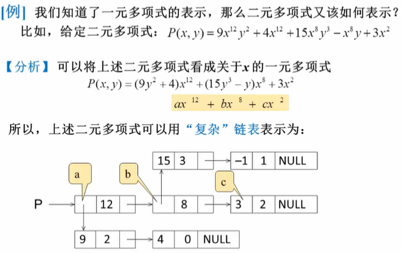

- 广义表是线性表的推广
- 对于线性表, n 个元素都是基本的单元素
- 广义表中, 这些元素不仅可以是单元素也可以是另一个广义表

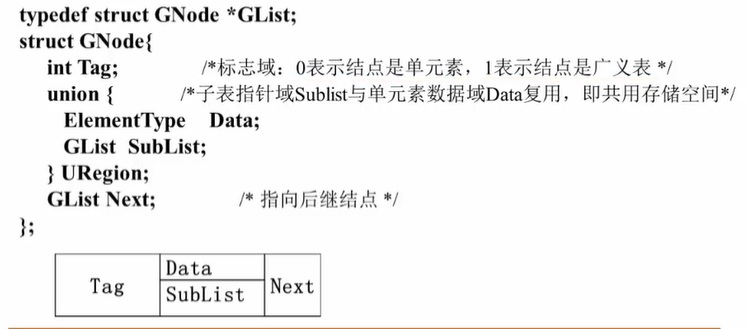

### 多重链表

- 链表中的结点可能同时隶属于多个链
  - 多重链表中结点的指针域会有多个, 比如前面的例子, 一个结点包括了`Next`和`SubList`两个指针域
  - 但是包含了多个指针域的链表不一定是多重链表, 比如双向链表不是多重链表
- 多重链表有广泛用途, 如**树**, **图**这样的复杂数据结构都可采取多重链表实现

#### 例子: 表示矩阵

- 矩阵可以用二维数组表示, 但是有两个缺陷
  - 一个是大小需要事先确定
  - 另外对于 "稀疏矩阵 (0很多) " 会造成大量存储空间浪费

我们只存储非零项! _十字链表 (Orthogonal List)

- 每个结点的数据域: 行坐标, 列坐标, 数值
- 每个结点通过两个指针域把同行同列串联起来:
  - 行指针`Right`
  - 列指针`Down`

假设有 A 矩阵: 
$$
A=
\begin{bmatrix}
18&0&0&2&0\\
0&27&0&0&0\\
0&0&0&-4&0\\
23&-1&0&0&12
\end{bmatrix}
$$
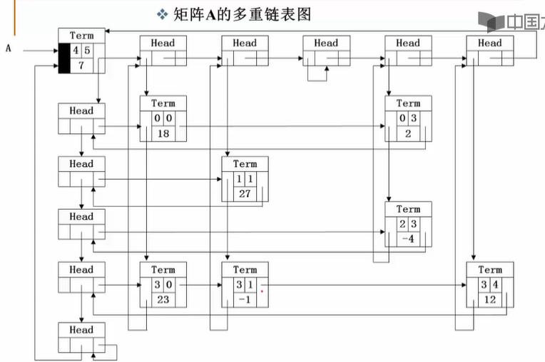

- `Term`结构: 同一行同一列都是循环链表
- `Head`结构: 行列的头节点
- 左上角的`Term`: 四行五列, 非零项有七项的入口结点

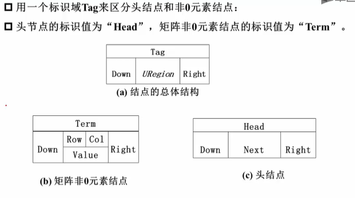

## 堆栈 (栈) (Stack)

### 什么是堆栈

#### 例子: 计算机如何进行算数表达式求值

表达式由两类对象构成:

- 运算数
- 运算符号 (有优先级)

表达式类型:

- 中缀表达式 `a + b * c - d / e`
- 后缀表达式`a b c * + d e / -`

计算机处理后缀表达式的算数表达式:

`6 2 / 3 - 4 2 * + = ?` -> `3 3 - 4 2 * + = ?` -> `0 4 2 * + = ?` -> `0 8 + = ?` -> `8`

- 从左往右扫描, 逐个存储处理运算数

> 需要一种存储方法, 顺数存储运算数, 并在需要的时候 "倒序" 输出

> > 这就是堆栈! (栈)

#### 堆栈的抽象数据类型描述

堆栈 (Stack): 具有一定操作约束的线性表, 只在一端 (栈顶, Top) 做插入, 删除

- 插入数据: 入栈 (Push)
- 删除数据: 出栈 (Pop)
- 先入后出 (后入先出): Last In First Out (LIFO) 

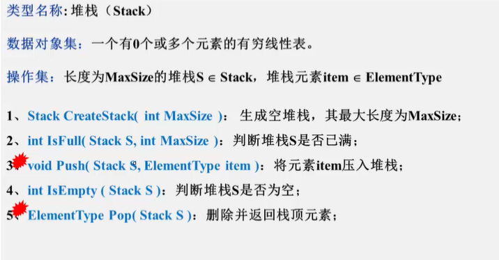

- `pop`的时候看空不空
- `push`的时候看满不满

`pop`和`push`可以穿插进行:

- Push(A), Push(B), Push(C), Pop(), Pop(), Pop() -> C B A
- Push(A), Pop(), Push(B), Push(C), Pop(), Pop() -> A C B

### 堆栈的顺序实现 (数组)

````c
#define MAX_SIZE <the max size of the stack>
typedef struct SNode* Stack;	// 可以放在结构声明的上面
struct SNode {
    ElementType Data[MAX_SIZE];
    int Top;	// 记录栈顶位置
}				
````

````c
// push
void Push(Stack PtrS, ElementType item) {
    if (PtrS->Top == MAX_SIZE - 1) {
        printf("堆栈满");
        return;
    }
    else {
        PtrS->Top ++;
        PtrS->Data[PtrS->Top] = item;
        return;
    }
}
````

````c
// pop
ElementType Pop(Stack PtrS) {
    if (PtrS->Top == -1) {
        printf("堆栈空");
        return ERROR;	// ERROR 应为 ElementType 的特殊值
    }
    else {
        return (PtrS->Data[(PtrS->Top)--]);
    }
}
````

#### 例子

用一个数组实现两个栈, 要求最大地利用数组空间, 使得只要有空间, `push`操作就可以成功

> 一个数组放两个堆栈, 一个从头向尾增长, 一个从尾向头增长

````c
#define MAXSIZE <MAXSIZE>
struct DStack {
    ElementType Data[MAXSIZE];
    int Top1;
    int Top2;
} S;
// 什么时候两个栈空? 
S.Top1 = -1;
S.Top2 = MAXSIZE;
// 什么时候满?
S.Top2 - S.Top1 == 1;
````

````c
// push
void Push(struct DStack* PtrS, ElementType item, int Tag) {
    // Tag 区分两个堆栈, 1 表示堆栈一, 2 表示堆栈二
    if (PtrS->Top2 - PtrS->Top1 == 1) {
        printf("堆栈满");
        return;
    }
    if (Tag == 1) {
        PtrS->Top1 ++;
        PtrS->Data[PtrS->Top1] = item;
    }
    else {
        PtrS->Top2 --;
        PtrS->Data[PtrS->Top2] = item;
    }
}
````

````c
// pop
ElementType Pop(struct DStack* PtrS, int Tag) {
    if (Tag == 1) {
        if (PtrS->Top1 == -1) {
            printf("堆栈1空");
        	return ERROR;	// ERROR 应为 ElementType 的特殊值
        }
        else {
            return (PtrS->Data[(PtrS->Top1)--]);
        }
    }
    else {
        if (PtrS->Top2 == MAXSIZE) {
            printf("堆栈2空");
        	return ERROR;	// ERROR 应为 ElementType 的特殊值
        }
        else {
            return (PtrS->Data[(PtrS->Top2)++]);
        }
    }
}
````

### 堆栈的链式实现 (链表)

- `Top`放在`Head`还是`Tail`?

> 放在`Head`更加方便

````c
typedef struct SNode* Stack;
struct SNode {
    ElementType Data;
    struct SNode* Next;
};
````

- 为了方便存储与操作, 给链式堆栈结构取一个栈头结点
  - 头结点不代表任何一个元素

````c
// create // 生成一个堆栈的头结点
Stack CreateStack() {
    Stack S;
    S = (Stack)malloc(sizeof(struct SNode));
    S->Next = '\0';
    return S;
}
````

````c
// 判断堆栈是否空 (不判断是否满, 因为是链表)
int IsEmpty(Stack S) {
    return (S->Next == '\0');
    // 空返回 1, 不空返回 0
}
````

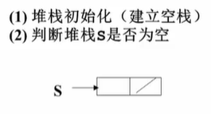

````c
// push
void Push(ElementType item, Stack S) {
    Stack p_tmp;
    p_tmp = (Stack)malloc(sizeof(struct SNode));
    p_tmp->Data = item;
    p_tmp->Next = S->Next;
    S->Next = p_tmp;
}
````

````c
// pop
ElementType Pop(Stack S) {
    if (IsEmpty(S)) {	//判断是否空
        printf("堆栈空");
        return ERROR;	// ERROR 应为 ElementType 的特殊值
    }
    ElementType top_ele;
    Stack p_tmp = S->Next;
    S->Next = p_tmp->Next;
    top_ele = p_tmp->Data;
    free(p_tmp);
    return top_ele;    
}
````

### 堆栈应用

#### 中缀表达式求值

> 将中缀表达式转换成后缀表达式, 后求值

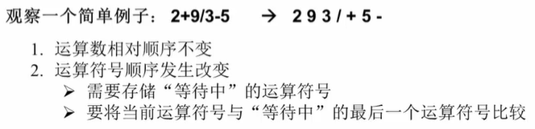

- 碰到运算数直接输出, 碰到符号先存起来
- 当前的符号优先级大于等待中最后一个则推入当前的

- 当前的符号优先级小于等待中最后一个则抛出等待中最后一个

- 有括号怎么办?

> 左括号当作运算符, 他相对于他右边的运算符优先级最低, 但是对于他左面的运算符, 左括号优先级最高

> 碰到右括号: 把堆栈顶的符号一个个抛出来, 不抛括号, 知道遇到左括号为止

- 相同优先级, 如栈顶是`*`, 此时`/`要入栈

> 相同优先级从左到右运算, 所以抛出`*`, 放入`/`

##### 中缀 -> 后缀

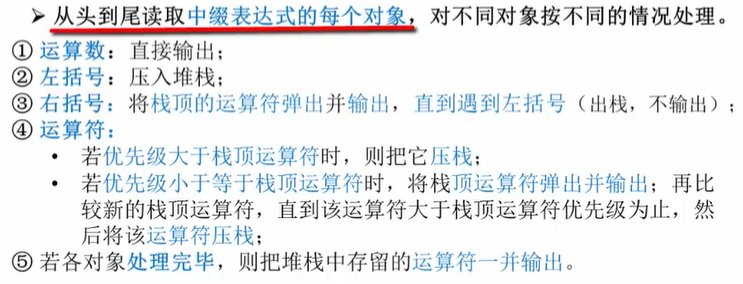

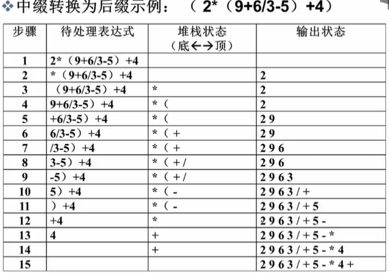

#### 函数调用及递归实现

按顺序的调用, 再倒过来一个个返回

#### 深度优先搜索

#### 回溯算法

"老鼠走迷宫".

## 队列 (Queue)

队列 (Queue): 只能在一端插入, 另一端删除的线性表

- 数据插入: 入队列 (AddQ)
- 数据删除: 出队列 (DeleteQ)
- 先来先服务, 先进先出: FIFO

### 队列的抽象数据类型描述

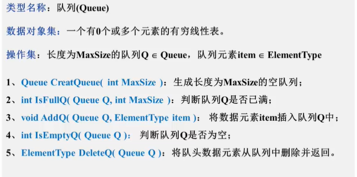

### 队列的顺序存储实现 (数组)

````c
#define MAXSIZE
struct QNode {
    ElementType Data[MAXSIZE];
    int rear;
    int front;
};
typedef struct QNode* Queue;
````

__空列最开始`front` `rear`都是`-1`__

`front`指队列头的前一个, `rear`指队列尾的那一个

删一个-`front++`

加一个-`rear++`

#### 循环队列:

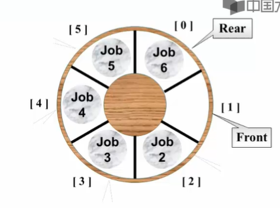

- `rear == front`时为 空? 满?

> 我们根据 `rear`和`front`的距离来判断空满, 但是他们距离只有`n`种可能, 而队列放的元素情况有`n+1`种, 必然会出现无法一一对应, `rear == front`无法判断空满

- 解决方法: 使用额外的标记 `size`表示元素个数, 或用`Tag`表示最后一次操作是add 还是 del
- 仅使用`n-1`的空间

````c
// 入队列
// 循环队列, 仅仅放 n-1 个元素
// 空列状态 rear, front 都是 0
void AddQ(Queue PtrQ, ElementType item) {
    if ((PtrQ->rear+1)%MAXSIZE == PtrQ->front) { //用求余实现n-1的下一个是0
        printf ("队列满");
        return;
    }
    PtrQ->rear = (PtrQ->rear+1)%MAXSIZE;
    PtrQ->Data[PtrQ->rear] = item;
}
````

````c
// 出队列
ElementType Delete(Queue PtrQ) {
    if (PtrQ->front == Ptr->rear) {
        printf("队列空");
        return ERROR;
    }
    else {
        PtrQ->front = (PtrQ->front+1)%MAXSIZE;
        return PtrQ->Data[PtrQ->front];
    }
}
````

### 队列的链式存储实现 (单向链表)

- 链表头: 插入删除都惩方便的
- 链表尾: 插入可, 删除了的话就不知道上一个在哪了

> 所以头做`front`, 尾做 `rear`

````c
struct Node {
    ElementType Data;
    struct Node* Next;
};
struct QNode {
    struct Node* rear;
    struct Node* front;
};
typedef struct QNode* Queue;
Queue PtrQ;
````

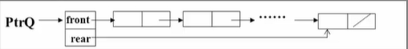

````c
ElementType DeleteQ(Queue PtrQ) {
    stuct Node* FrontCell;
    ElementType FrontElem;	// store the 1st elem
    if (PtrQ->front == '\0') {
        printf("队列空");
        return ERROR;
    }
    FrontCell = PtrQ->front;
    if (PtrQ->front == PtrQ->rear) {	// 若队列仅一个元素
        PtrQ->front = PtrQ->rear = '\0';
    }
    else {
        PtrQ->front = PtrQ->front->Next;
    }
    Frontelem = FrontCell->Data;
    free(Frontcell);
    return Frontelem;
}
````

## 应用: 多项式加法, 乘法算法

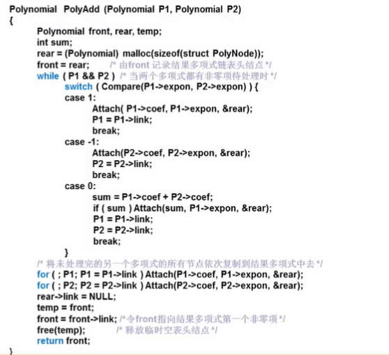

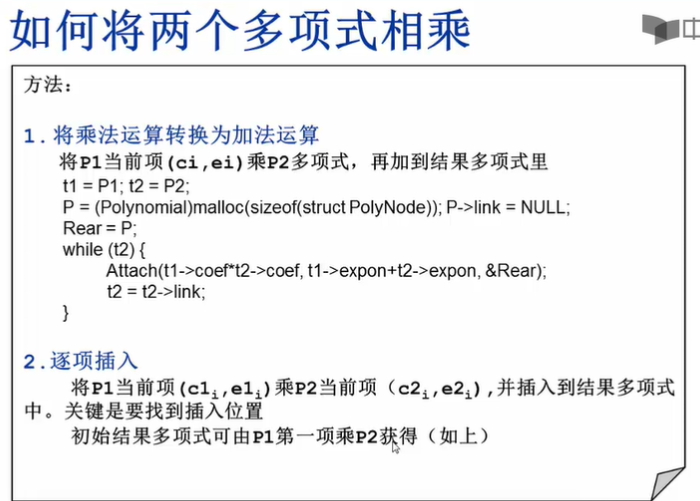

