# 03树(上)

## 树 与 树的表示

### 引子

- 查找: 给定__关键字K__, 从集合R中找出与K相同的记录
  - 静态查找: 集合中的记录是固定的
    - 没有插入和删除, 只有查找
  - 动态查找: 集合中的记录是动态变化的
    - 由插入, 删除, 查找

#### 静态查找

##### 顺序查找

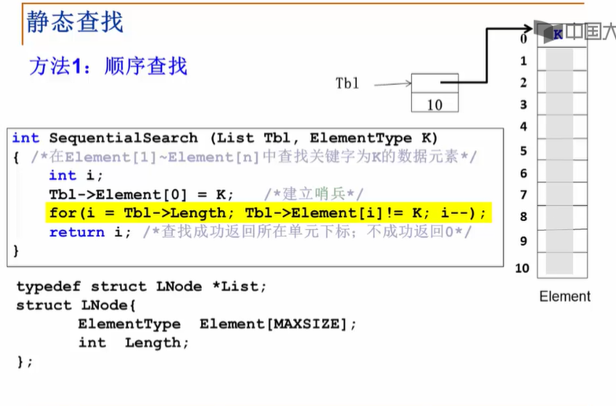

将要查找的值赋给`k`, 这样循环判断可以少一个分支, 只要遇到`k`退出循环即可.

- 得到`0`: 没有这个值
- 得到非零: 下标即得到

##### 二分查找

- 数据必须放数组里
- 数据必须有顺序

````c
int BinarySearch(int list[], int leftnum, int rightnum, int x) {
	while (leftnum <= rightnum) {
		int mid = (leftnum + rightnum) / 2;
		if (x == list[mid]) {
			return mid;
		}
		else if (x < list[mid]) {
			rightnum = mid - 1;
		}
		else {
			leftnum = mid + 1;
		}
	}
	return -1;	// if not find
}
````

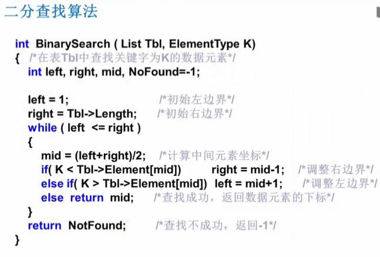

- 十一的元素的二分查找判定树

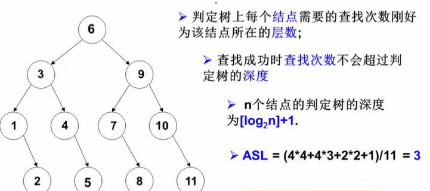

如果把数据就存成树这个样子?

> 查找树

### 树的定义和术语

#### 定义

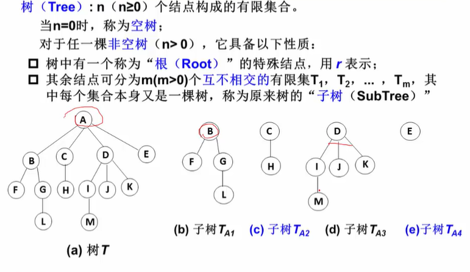

- 子树不相交
- 除了根结点外, 每个结点有且仅有一个父结点
- 一颗 N 个结点的树有 N-1 条边

#### 术语

- 结点的度 (Degree): 结点的子树的个数 (一个结点连的向下的线的个数)
- 树的度: 所有 Degree 中最大的那个
- 叶结点 (Leaf): Degree == 0 的结点
- 父结点 (Parent)
- 子结点 (Child)
- 兄弟结点 (Sibling): 拥有同一个父结点的各个结点们
- 路径和路径的长度: 
  - 路径: 从结点1到结点n的路径是一个结点序列
  - 路径长度: 路径所包含的边的个数
- 祖先结点 (Ancestor)
- 子孙结点 (Descendant)
- 结点的层级 (Level): 根在1层, 其他任意结点层级是父节点层级+1
- 树的深度 (Depth): 树所有结点中最大层次

### 树的表示

- 每个结点设计成一样的结构

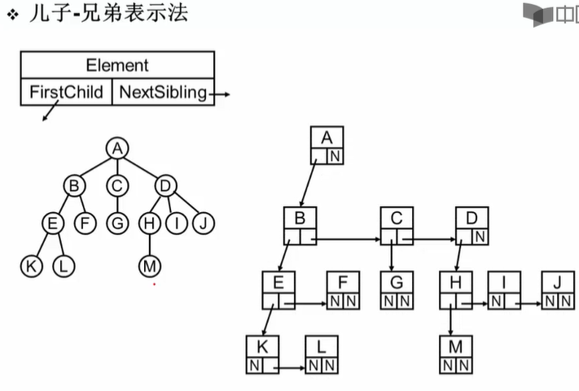

- 这就是一种二叉树 (binary tree)

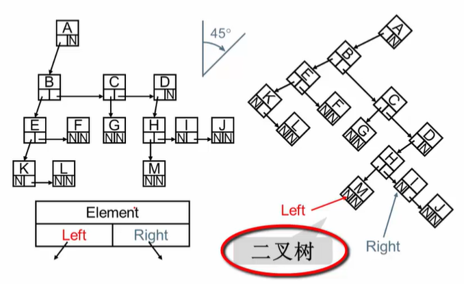

- 一般的树都可以转换成二叉树的表示

````c
typedef struct TNode *Position;
typedef Position BinTree; /* 二叉树类型 */
struct TNode{ /* 树结点定义 */
    ElementType Data; /* 结点数据 */
    BinTree Left;     /* 指向左子树 */
    BinTree Right;    /* 指向右子树 */
};
````

## 二叉树及存储结构

### 二叉树的定义与性质

- 二叉树的五种基本形态
  - 空
  - 只有根结点
  - 只有左子树
  - 只有右子树
  - 左右都有

- 特殊的二叉树
  - 斜二叉树 (相当于链表)
    - 只有左孩子
    - 只有右孩子
  - 完美二叉树 (满二叉树)
  - 完全二叉树: 有n个结点的二叉树, 对树中的结点从上到下, 从左往右进行编号, 编号为i的结点与满二叉树中位置相同

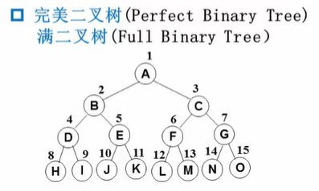

- 性质

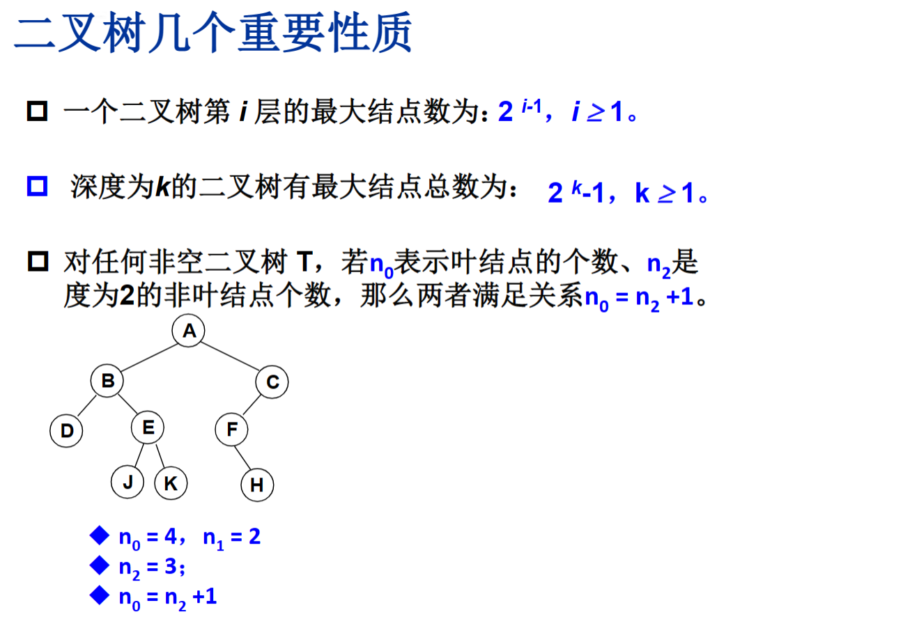

### 二叉树的抽象数据类型

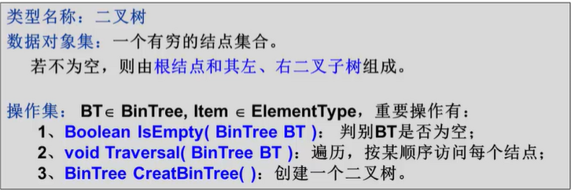

__二叉树的遍历最为重要__

基本的四种遍历方法:

````c
void PreOrderTraversal(BinTree BT);
// 先序_根->左子树->右子树
void InOrderTraversal(BinTree BT);
// 中序_左子树->根->右子树
void PostOrderTraversal(BinTree BT);
// 后序_左子树->右子树->根
void LevelOrderTraversal(BinTree BT);
// 层次遍历_从上到下, 从左到右
````

### 二叉树的存储结构

#### 顺序存储

- 存储完全二叉树非常方便

> 按照从上到下, 从左到右的顺序存储n个结点的完全二叉树的结点父子关系

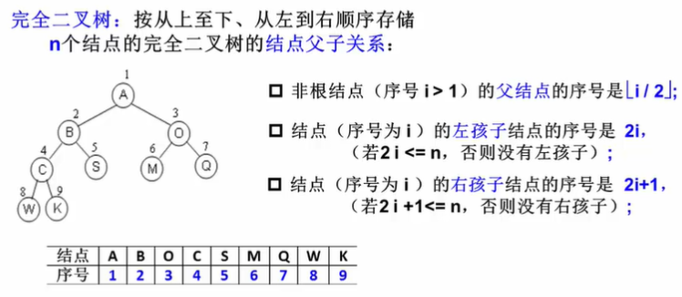

- 一般二叉树也可, 需要补全, 但是会浪费空间

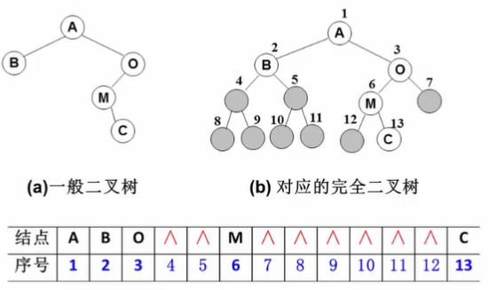

#### 链表存储

````c
typrdef struct _Node {
    ElementType data;
    struct _Node* left;
    struct _Node* right;  
} TreeNode;
typedef TreeNode* BinTree;
````

## 二叉树的遍历

### 先序遍历

1. 访问根节点
2. 先序遍历左子树
3. 先序遍历右子树

````c
void PreOrderTraversal(BinTree BT) {
    if (BT) {	// 判断是否空
        printf("%d", BT->data);
        PreOrderTraversal(BT->left);
        PreOrderTraversal(BT->right);    
    }
}
````

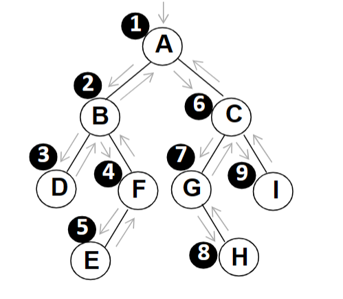

### 中序遍历

1. 中序遍历左子树
2. 访问根结点
3. 中序遍历右子树

````c
void InOrderTraversal(BinTree BT) {
    if (BT) {	// 判断是否空
        InOrderTraversal(BT->left);
        printf("%d", BT->data);
        InOrderTraversal(BT->right);    
    }
}
````

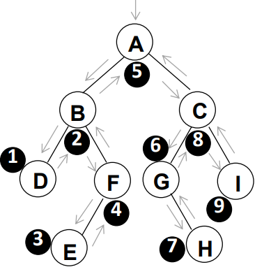

### 后序遍历

1. 后续遍历左子树
2. 后序遍历右子树
3. 访问根节点

````c
void PostOrderTraversal(BinTree BT) {
    if (BT) {	// 判断是否空
        PostOrderTraversal(BT->left);
        PostOrderTraversal(BT->right);   
        printf("%d", BT->data); 
    }
}
````

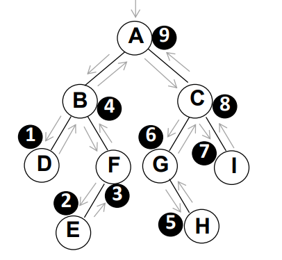

- 这三种遍历的过程中经历的结点**路线一样**, 只是访问的时机不同

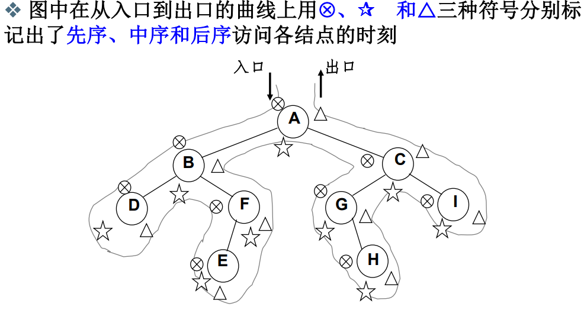

- 每个结点都有三次碰到他的机会
  - 第一次碰到就访问: 先序 (中序, 后序同理)

- 递归本质还是使用了堆栈的形式

### 二叉树的非递归遍历

- 中序遍历的非递归遍历

> 使用堆栈

1. 遇到一个结点, 把他`push`, 并去遍历他的左子树
2. 左子树遍历结束后, 从栈顶弹出这个结点并访问
3. 再按其右指针去中序遍历该结点的右子树

````c
void InOrderTraversal(BinTree BT) {
    BinTree tmp_bt = BT;
    Stack S = CreateStack(MAXSIZE); // 建立空堆栈
    while (tmp_bt || !IsEmpty(S)) {
        while(tmp_bt) {		// 一直向左并将沿途的结点压入堆栈 
        	Push(S, tmp_bt);	// 第一次遇到这个结点
			tmp_bt = tmp_bt->left;     
        }
        if (!IsEmpty(S)) {
			tmp_bt = Pop(S);	// 结点弹出堆栈
            // pop处是第二次遇到这个结点
            printf("%d", tmp_bt->data);	// 访问
            tmp_bt = tmp_bt->right;	// 转向右子树
            // 右子树为 NULL ->访问根咯
        }
    }
}
````

- 很容易就可以得到先序的非递归遍历算法

````c
void PreOrderTraversal(BinTree BT) {
    BinTree tmp_bt = BT;
    Stack S = CreateStack(MAXSIZE); // 建立空堆栈
    while (tmp_bt || !IsEmpty(S)) {
        while(tmp_bt) {		// 一直向左并将沿途的结点压入堆栈 
        	Push(S, tmp_bt);	// 第一次遇到这个结点
            printf("%d", tmp_bt->data);	// 访问
			tmp_bt = tmp_bt->left;     
        }
        if (!IsEmpty(S)) {
			tmp_bt = Pop(S);	// 结点弹出堆栈
            // pop处是第二次遇到这个结点
            // printf("%d", tmp_bt->data);
            tmp_bt = tmp_bt->right;	// 转向右子树
            // 右子树为 NULL ->访问根咯
        }
    }
}
````

### 层序遍历

- 二维结构的线性化
  - 从结点访问他的左右孩子结点
  - 访问左孩子后, 右孩子怎么办! ?

> 保存一下: 用堆栈 (保存父), 队列 (保存右孩子)

队列实现: 

遍历从根结点开始, 首先让根结点入队, 然后开始循环: 结点出队, 访问该结点, 其左右孩子入队

- 这就是**层序遍历**

````c
void LevelOrderTraversal(BinTree BT) {
    Queue Q; BinTree T;
    if (!BT) {
        return;	// 若是空树直接返回
    }
    Q = CreateQueue(MAXSIZE);	// 创建空队列
    AddQ(Q, BT);
    while (!IsEmptyQ(Q)) {
        T = DeleteQ(Q);
        printf("%d", T->data);
        if (T->left) {
            AddQ(Q, T->left);
        }
        if (T->right) {
            AddQ(Q, T->right);
        }
    }
}
````

### 二叉树遍历应用

- 输出叶子结点

````c
void PreOrderPrintLeaves(BinTree BT) {
    if (BT) {
        if (!BT->left && !BT->right) {
            printf("%d", BT->data);
        }
        PreOrderPrintLeaves(BT->left);
        PreOrderPrintLeaves(BT->right);        
    }
}
````

- 求二叉树高度

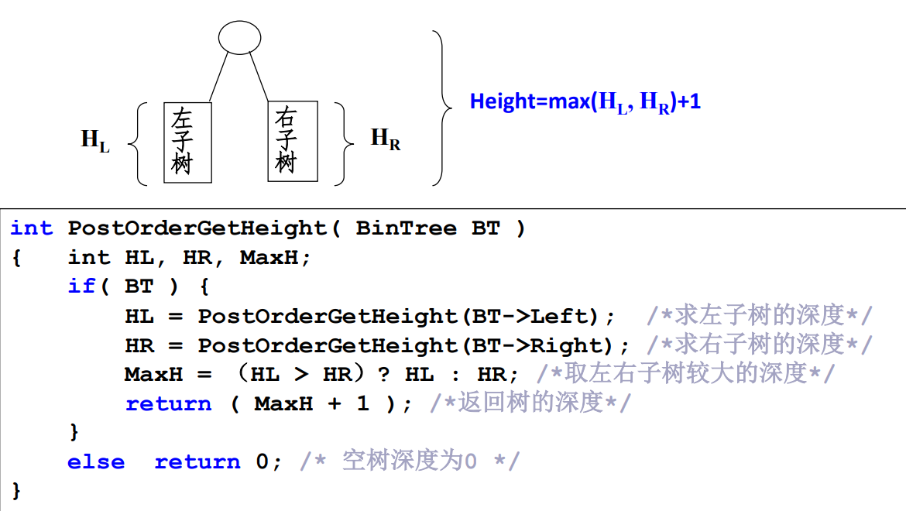

- 二元运算表达式树

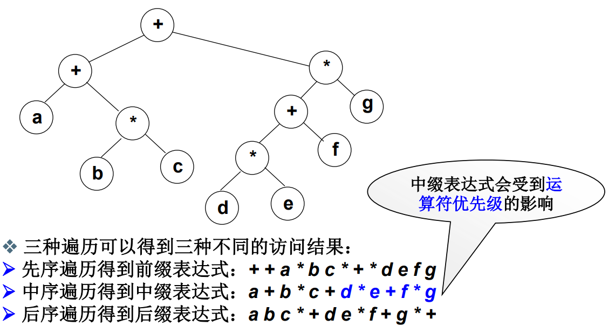

中缀表达式不准?

> 在输出左子树前加上左括号, 结束时加右括号

- 由两种遍历序列确定二叉树

> 必须知道中序, 然后再知道前序后序任意一个即可

- - 具体怎么确定?

例: 由中序和先序确定一颗二叉树

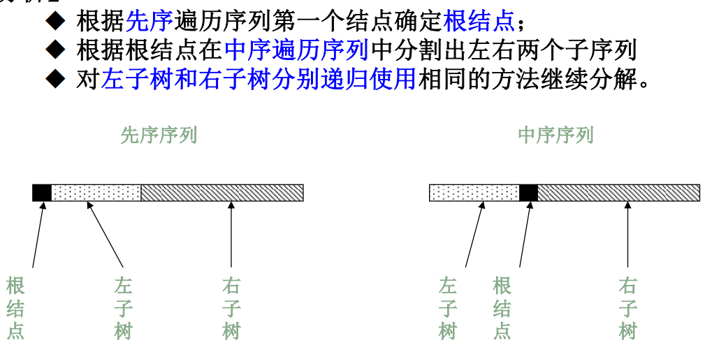
