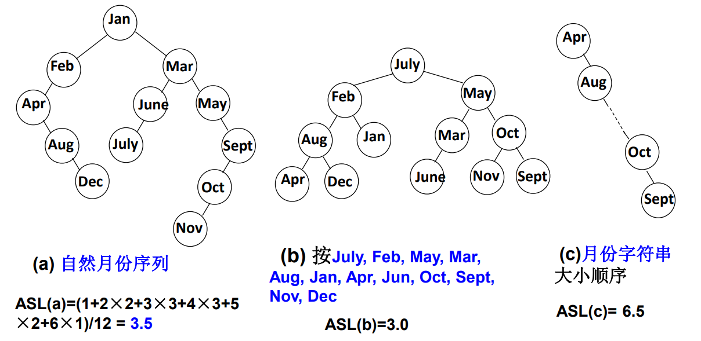
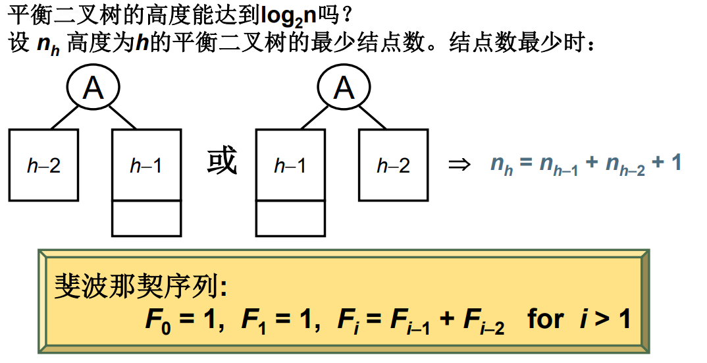
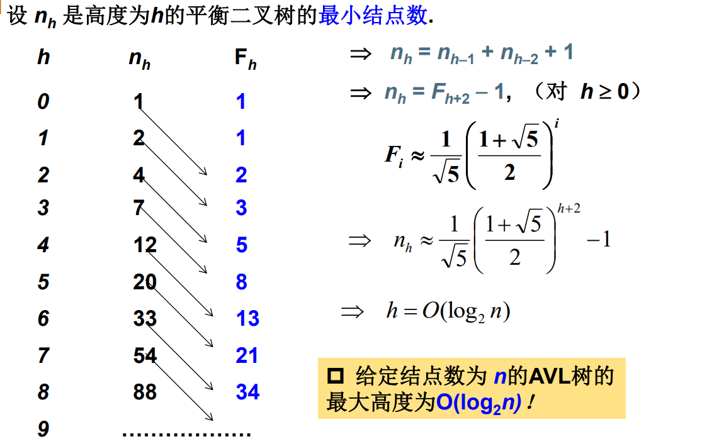
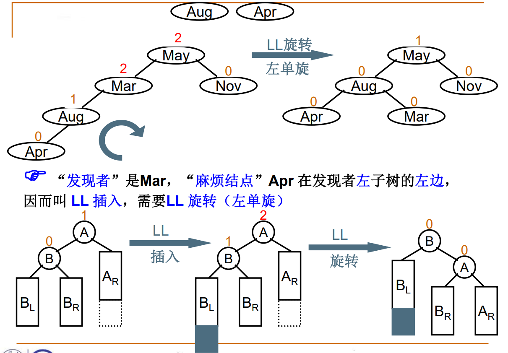
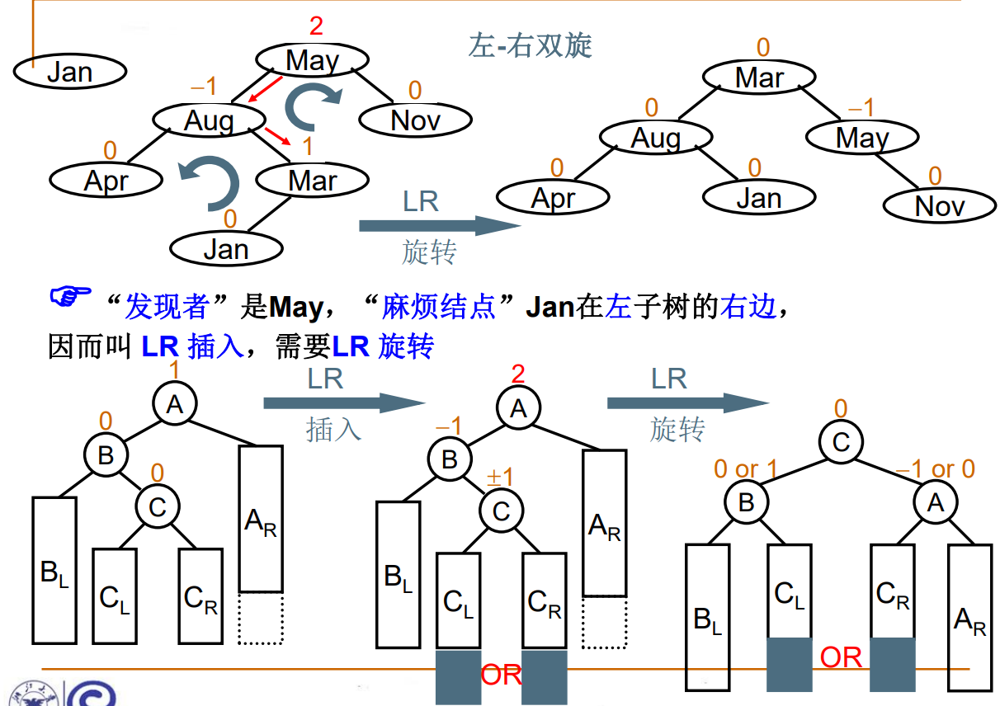
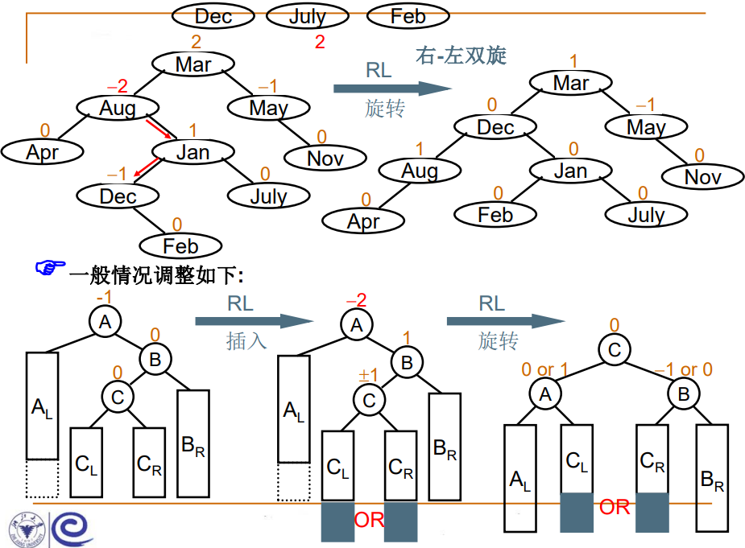
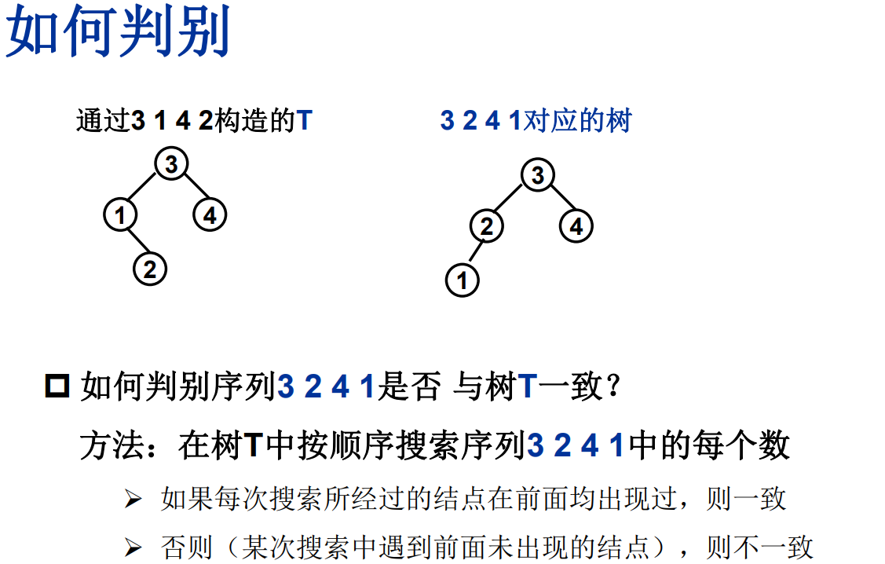

# 04树(中)

## 二叉搜索树

- 静态查找
  - 顺序遍历, 二分
- 动态查找
  - 二叉搜索树 (二叉排序树) (二叉查找树) (BST)

### 什么是二叉搜索树

一颗二叉树, 可以空或者非空. 若非空, 满足: 

1. 非空左子树的所有键值小于其根节点
2. 非空右子树的所有键值大于其根节点
3. 左右子树都是二叉搜索树


### 操作集

````c
Position Find( ElementType X, BinTree BST );
// 在 BST 中查找元素 X, 返回其结点地址
Position FindMin( BinTree BST );
// 在 BST 中查找 min 元素并返回其结点地址
Position FindMax( BinTree BST );
// 在 BST 中查找 max 元素并返回其结点地址
BinTree Insert( ElementType X, BinTree BST );
BinTree Delete( ElementType X, BinTree BST );
````

````c
// Find
// 尾递归 (效率一般)
Position Find( ElementType X, BinTree BST ) {
    if ( !BTS ) {
        return NULL;
    }
    if ( X > BST->data ) {
        return Find( X, BST->right );
    }
    else if ( X < BST->data ) {
        return Find( X, BST->left );
    }
    else {
        return BST;
    }
}

// loop
Position Find( ElementType X, BinTree BST ) {
    while (BST) {
        if ( X > BST->data ) {
            BST = BST->right;
        }
        else if ( X < BST->left ) {
            BST = BST->left;
        }
        else {
            return BST;
        }
    }
    return NULL;
}
// 查找效率取决于树的深度
````

````c
// find max	// 一定在最右的端结点
// find min	// 一定在最左的端结点
Position FindMin( BinTree BST ) {
    if ( BST ) {
        while ( BST->left ) {
            BST = BST->left;
        }
    }
    return BST;
}
Position FindMax( BinTree BST ) {
    if ( BST ) {
        while ( BST->right ) {
            BST = BST->right;
        }
    }
    return BST;
}
````

````c
// BST 的插入
// 递归
BinTree Insert( ElementType X, BinTree BST ) {
    if ( !BST ) {
        BST = (BinTree)malloc(sizeof(struct TreeNode));
        BST->data = X;
        BST->left = BST->right = NULL;
    }
    else {
        if ( X < BST->data ) {
            BST->left = Insert( X, BST->left );
        }
        else if ( X > BST->data ) {
            BST->right = Insert( X, BST->right );
        }
        // else X 已经存在， 什么都不做
    }
    return BST;
}
// loop
BinTree Insert( ElementType X, BinTree BST ) {
    while ( 1 ) {
        if ( X < BST->data ) {
            if ( !BST ->left ) {
                BST ->left = (BinTree)malloc(sizeof(struct TreeNode));
                BST = BST->left;
                BST->data = X;
                BST->left = BST->right = NULL;
                break;
            }
            else {
                BST = BST->left;
            }
        }
        else if ( X > BST->data ) {
            if ( !BST ->right ) {
                BST ->right = (BinTree)malloc(sizeof(struct TreeNode));
                BST = BST->right;
                BST->data = X;
                BST->left = BST->right = NULL;
                break;
            }
            else {
                BST = BST->right;
            }
        }
        else {
            break;
        }
    }
    return BTS;
}
````

````c
// BST 的删除
// - 删除叶: 直接删除, 修改其父结点指针
// - 删除一个孩子的结点: 父结点的指针指向要删除的结点的孩子结点
// - 删除两个孩子的结点: 用另一个结点代替被删除结点: 右子树的min 或 左子树的max
BinTree Delete( ElementType X, BinTree BST ) {
    BinTree tmp;
    if ( !BST ) {
        printf("未找到要删除的元素");
    } 
    else if ( X > BST->data ) {
        BST->right = Delete( X, BST->right );
    }
    else if ( X < BST->data ) {
        BST->left = Delete( X, BST->left );
    }
    else {
        if (BST->left && BST->right) {  
            tmp = FindMin( BST->right );
            BST->data = tmp->data;
            BST->right = Delete( BST->data, BST->right );
        }
        else {
            tmp = BST;
            if ( !BST->left ) { // 有右孩子或者无子结点
                BST = BST->right;
            }
            else if ( !BST->right ) {	// 有左孩子或者无子结点
                BST = BST->left;
            }
            free( tmp );
        }
    }
    return BST;
}
````

## 平衡二叉树

### 什么是平衡二叉树

- 搜索树结点不同插入次序会导致树深度不同, 导致不同的平均查找长度 ASL



"平衡因子 (Balance Factor, BF)": BF(T) = 左子树高度 - 右子树高度

平衡二叉树 (AVL树): 空树, 或者任一结点左右子树高度差绝对值不超过1





### 平衡二叉树的调整








## 小白专场

给定一个插入序列就可以唯一确定一棵二叉搜索树。然而，一棵给定的二叉搜索树却可以由多种不同的插入序列得到。例如分别按照序列{2, 1, 3}和{2, 3, 1}插入初始为空的二叉搜索树，都得到一样的结果。于是对于输入的各种插入序列，你需要判断它们是否能生成一样的二叉搜索树。

### 输入格式:

输入包含若干组测试数据。每组数据的第1行给出两个正整数*N* (≤10)和*L*，分别是每个序列插入元素的个数和需要检查的序列个数。第2行给出*N*个以空格分隔的正整数，作为初始插入序列。随后*L*行，每行给出*N*个插入的元素，属于*L*个需要检查的序列。

简单起见，我们保证每个插入序列都是1到*N*的一个排列。当读到*N*为0时，标志输入结束，这组数据不要处理。

### 输出格式:

对每一组需要检查的序列，如果其生成的二叉搜索树跟对应的初始序列生成的一样，输出“Yes”，否则输出“No”。

### 输入样例:

```in
4 2
3 1 4 2
3 4 1 2
3 2 4 1
2 1
2 1
1 2
0
```

### 输出样例:

```out
Yes
No
No
```

### 解:

1. 法一: 建两棵树
2. 法二: 不建树, 仅从序列比较
3. __法三: 建一棵树, 比较其他序列和这棵树是否一致__ _本节课所采用方法

````c
typedef struct _Node {
    int v;
    struct _Node* left;
    struct _Node* right;
    int flag;	// 某个结点没被访问过, flag = 0 
    			// 某个结点被访问过, flag = 1
};
````



````c
// 一坨屎这个代码
#include <stdio.h>
#include <stdlib.h>

typedef struct _Node {
    int data;
    struct _Node* left; 
    struct _Node* right;
    int flag;
} TreeNode;
typedef TreeNode* BinTree;

BinTree make_tree( int n );
BinTree insert( BinTree BST, int X );
int judge( BinTree BST, int n );
int check( BinTree BST, int v );
void reset( BinTree BST );

int main() {
    int n, l, i, val;
    scanf("%d", &n);
    while ( n ) {
        BinTree t0;
        scanf("%d", &l);
        t0 = make_tree( n );
        while ( l-- ) { // judge
            judge( t0, n ) ? printf("Yes\n") : printf("No\n");
            reset( t0 );// reset flag to 0
        }
        scanf("%d", &n);
    }
    return 0;
}

BinTree make_tree( int n ) {
    BinTree t;
    int i, v;
    for ( i=0; i<n; i++ ) {
        scanf("%d", &v);
        insert( t, v );
    }
    return t;
}

BinTree insert( BinTree BST, int X ) {
    BinTree tmp;
    if ( !BST ) {
        tmp = (BinTree)malloc(sizeof(TreeNode));
        tmp->data = X;
        tmp->left = tmp->right = 0;
        tmp->flag = 0;
        return tmp;
    }
    else {
        if ( X > BST->data ) {
            BST->right = insert( BST->right, X );
        }
        else if ( X < BST->data ) {
            BST->left = insert( BST->left, X );
        }
    }
    return BST;
}

int judge( BinTree BST, int n ) {
    int res = 1, v, i;
    for ( i=0; i<n; i++ ) {
        scanf("%d", &v);
        if ( res && (!check( BST, v )) ) {    // 必须得把 n 个数扫完, 但是如果已经发现错误了, 也就不用 check 了
            res = 0;
        }
    }
    return res;
}

int check( BinTree BST, int v ) {
    if ( BST ) {
        if ( BST->flag ) {  // if this node has been checked
            if ( v < BST->data ) {
                return check( BST->left, v );
            }
            else if ( v > BST->data ) {
                return check( BST->right, v );
            }
            else {
                return 0;   // only when this array has 2 same nums
            }
        }
        else {
            if ( v == BST->data ) {
                BST->flag = 1;
                return 1;
            }
            else {
                return 0;
            }
        }
    }
    return 0;
}

void reset( BinTree BST ) {
    if ( BST ) {    // if BST is not empty
        reset( BST->left );
        reset( BST->right );
        BST->flag = 0;
    }
}
     
````


