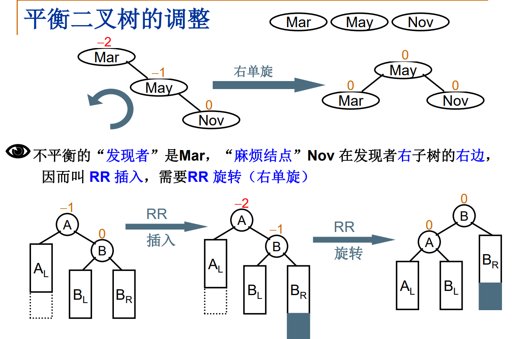

# 04树(中)

## 二叉搜索树

- 静态查找
  - 顺序遍历, 二分
- 动态查找
  - 二叉搜索树 (二叉排序树) (二叉查找树) (BST)

### 什么是二叉搜索树

一颗二叉树, 可以空或者非空. 若非空, 满足: 

1. 非空左子树的所有键值小于其根节点
2. 非空右子树的所有键值大于其根节点
3. 左右子树都是二叉搜索树


### 操作集

````c
Position Find( ElementType X, BinTree BST );
// 在 BST 中查找元素 X, 返回其结点地址
Position FindMin( BinTree BST );
// 在 BST 中查找 min 元素并返回其结点地址
Position FindMax( BinTree BST );
// 在 BST 中查找 max 元素并返回其结点地址
BinTree Insert( ElementType X, BinTree BST );
BinTree Delete( ElementType X, BinTree BST );
````

````c
// Find
// 尾递归 (效率一般)
Position Find( ElementType X, BinTree BST ) {
    if ( !BTS ) {
        return NULL;
    }
    if ( X > BST->data ) {
        return Find( X, BST->right );
    }
    else if ( X < BST->data ) {
        return Find( X, BST->left );
    }
    else {
        return BST;
    }
}

// loop
Position Find( ElementType X, BinTree BST ) {
    while (BST) {
        if ( X > BST->data ) {
            BST = BST->right;
        }
        else if ( X < BST->left ) {
            BST = BST->left;
        }
        else {
            return BST;
        }
    }
    return NULL;
}
// 查找效率取决于树的深度
````

````c
// find max	// 一定在最右的端结点
// find min	// 一定在最左的端结点
Position FindMin( BinTree BST ) {
    if ( BST ) {
        while ( BST->left ) {
            BST = BST->left;
        }
    }
    return BST;
}
Position FindMax( BinTree BST ) {
    if ( BST ) {
        while ( BST->right ) {
            BST = BST->right;
        }
    }
    return BST;
}
````

````c
// BST 的插入
// 递归
BinTree Insert( ElementType X, BinTree BST ) {
    if ( !BST ) {
        BST = (BinTree)malloc(sizeof(struct TreeNode));
        BST->data = X;
        BST->left = BST->right = NULL;
    }
    else {
        if ( X < BST->data ) {
            BST->left = Insert( X, BST->left );
        }
        else if ( X > BST->data ) {
            BST->right = Insert( X, BST->right );
        }
        // else X 已经存在， 什么都不做
    }
    return BST;
}
// loop
BinTree Insert( ElementType X, BinTree BST ) {
    while ( 1 ) {
        if ( X < BST->data ) {
            if ( !BST ->left ) {
                BST ->left = (BinTree)malloc(sizeof(struct TreeNode));
                BST = BST->left;
                BST->data = X;
                BST->left = BST->right = NULL;
                break;
            }
            else {
                BST = BST->left;
            }
        }
        else if ( X > BST->data ) {
            if ( !BST ->right ) {
                BST ->right = (BinTree)malloc(sizeof(struct TreeNode));
                BST = BST->right;
                BST->data = X;
                BST->left = BST->right = NULL;
                break;
            }
            else {
                BST = BST->right;
            }
        }
        else {
            break;
        }
    }
    return BTS;
}
````

````c
// BST 的删除
// - 删除叶: 直接删除, 修改其父结点指针
// - 删除一个孩子的结点: 父结点的指针指向要删除的结点的孩子结点
// - 删除两个孩子的结点: 用另一个结点代替被删除结点: 右子树的min 或 左子树的max
BinTree Delete( ElementType X, BinTree BST ) {
    BinTree tmp;
    if ( !BST ) {
        printf("未找到要删除的元素");
    } 
    else if ( X > BST->data ) {
        BST->right = Delete( X, BST->right );
    }
    else if ( X < BST->data ) {
        BST->left = Delete( X, BST->left );
    }
    else {
        if (BST->left && BST->right) {  
            tmp = FindMin( BST->right );
            BST->data = tmp->data;
            BST->right = Delete( BST->data, BST->right );
        }
        else {
            tmp = BST;
            if ( !BST->left ) { // 有右孩子或者无子结点
                BST = BST->right;
            }
            else if ( !BST->right ) {	// 有左孩子或者无子结点
                BST = BST->left;
            }
        }
    }
    return BST;
}
````

## 平衡二叉树

### 什么是平衡二叉树

- 搜索树结点不同插入次序会导致树深度不同, 导致不同的平均查找长度 ASL


"平衡因子 (Balance Factor, BF)": BF(T) = 左子树高度 - 右子树高度

平衡二叉树 (AVL树): 空树, 或者任一结点左右子树高度差绝对值不超过1


### 平衡二叉树的调整




